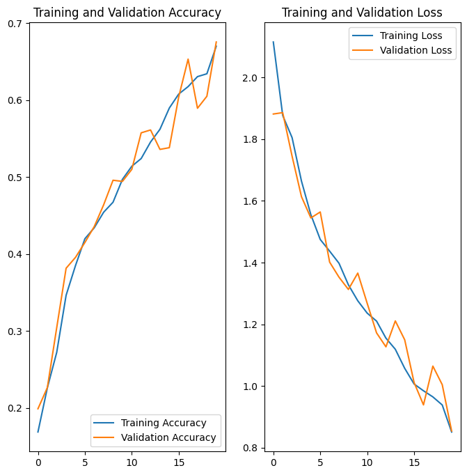
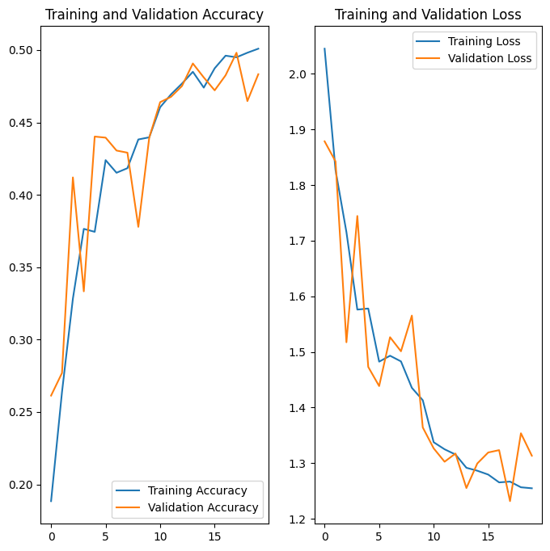
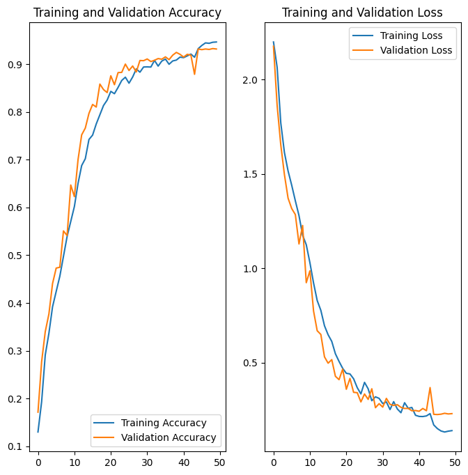

# CNN based Melanoma Detection Model
 CNN based model which can accurately detect melanoma

# CNN Based Model To detect Melenoma
> This project uses a custom CNN to detect melanoma in images of skin lesions among 9 classes. The Gradio library is used to create a web app for the model prediction. The model predicts with an 87% accuracy.

## Table of Contents
* Melanoma-Detection-using-using-custom-cnn
    * Table of Contents
    * General Information
        * Algorithms Used
        * Dataset Information
    * Steps Involved
    * Results
        * Baseline Model
        * Augmented Model
        * Final Model
    * Conclusion
    * Technologies Used
    * Contact
    * License

<!-- You can include any other section that is pertinent to your problem -->

## General Information
### Algorithm Used
Convolution Neural Network
     
### Dataset Information
The dataset consists of 2357 images of malignant and benign oncological diseases, which were formed by the International Skin Imaging Collaboration (ISIC). All images were sorted according to the classification taken with ISIC, and all subsets were divided into the same number of images, with the exception of melanomas and moles, whose images are slightly dominant.

The data set contains the following diseases:
* Actinic keratosis
* Basal cell carcinoma
* Dermatofibroma
* Melanoma
* Nevus
* Pigmented benign keratosis
* Seborrheic keratosis
* Squamous cell carcinoma
* Vascular lesion
### Steps Involved
* Data Loading
* Baseline Model Building
* Training the Model and testing the model
* Building an augmented model
* Training the augmented model and testing the model
* Countering Class Imbalance with augmentor
* Building the final model
* Training the final model and testing the model
* Verifying the model

### Results
- Baseline Model
   Accuracy and Loss charts for the Base model
  
- Augmented Model
   Accuracy and Loss charts for the augmented model
  
- Final Model
       Accuracy and Loss charts for the final model
       

 

<!-- You don't have to answer all the questions - just the ones relevant to your project. -->

## Conclusions
As the accuracy of the model increases, the loss decreases. The final model has validation accuracy of 88% and validation loss of 0.3. The model is able to predict the class of the lesion with a high accuracy. Augmenting the data and countering class imbalance helped in improving the accuracy of the model

<!-- You don't have to answer all the questions - just the ones relevant to your project. -->

## Technologies Used
- Google Colab
- tensorFlow v2.11.0

<!-- As the libraries versions keep on changing, it is recommended to mention the version of library used in this project -->

## Contact
Created by [@uday16041985] - feel free to contact me!

<!-- Optional -->
<!-- ## License -->
<!-- This project is open source and available under the [... License](). -->

<!-- You don't have to include all sections - just the one's relevant to your project -->
